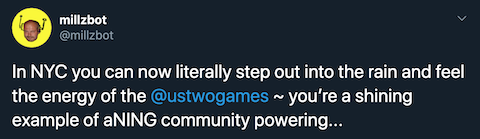
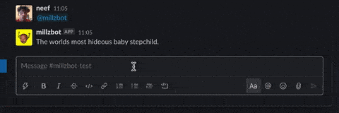

# millzbot

A GPT-2 chatbot trained on my bosses tweets, and a guide to making your own!

## Introduction

After seeing so many projects being made with [OpenAI's GPT-2](https://openai.com/blog/better-language-models/), I decided to give it a whirl myself as a first foray into training a machine learning model, as well as building bots for Slack and Twitter. It took me no time to think of using [@millsustwo](https://twitter.com/millsustwo)'s tweets to fine-tune the model (with his permission). If GPT-2 can adapt to his _unique_ writing style then it really is as good as they say.

Luckily, it is that good! Millzbot lives [on Twitter](https://twitter.com/millzbot), on [a demo site](https://millzbot.neef.co/), and as a slackbot in ustwo's Slack workspace.

 

(The model is working fine. [He actually tweets like that!](https://twitter.com/millsustwo))

[Talk to millzbot (live demo)](https://millzbot.neef.co/) | [Follow millzbot on Twitter](https://twitter.com/millzbot) | [See some of my favourite responses from millzbot](https://github.com/neefrehman/millzbot/blob/master/faves.md)

## Make your own

On the whole the process was surprisingly easy, thanks hugely to [Max Woolf](https://github.com/minimaxir) and the writing/tools that he's already created around GPT-2. In this repo you'll find a summary of the process I used to make millzbot (with links to the guides and resources I used), and some of Max's tweet-fetching and server code. You'll also see some of my additional code, like middleware API layers to provide responses from the trained model to different platforms (Slack, Twitter and the demo site), written as serverless functions.

The instructions below and code in this project's folders should cover everything you need to do the following:

1. Get your initial dataset
2. Use it to fine-tune a GPT-2 instance with [Google Colaboratory](https://colab.research.google.com/)
3. Build and test your trained model locally in a [Docker](https://docker.com/) container
4. Deploy your container to a server with [Cloud Run](https://cloud.google.com/run/)
5. Request generated text from it via simple `POST` requests or serverless functions

And at the end of it you should have your own GPT-2 bot (for free!). I highly recommend that you also read through the links that I reference for more detailed instructions, and to get a more thorough understanding of GPT-2.

### Training the model

Fork this repo and clone it to your computer, then go to the `training` folder. In there you'll find [a script written by Max](https://github.com/minimaxir/download-tweets-ai-text-gen/blob/master/README.md) that can bulk download tweets from a user, and [instructions on how to use it](https://github.com/neefrehman/millzbot/tree/master/training#getting-training-data). Once you have the tweets downloaded, just follow the instructions on [Max's Colaboratory notebook](https://colab.research.google.com/drive/1qxcQ2A1nNjFudAGN_mcMOnvV9sF_PkEb) to train the model with a GPU (for free).

If you're not training the model on tweets, and instead are using some other text source, then make sure you have that dataset ready, and use [this notebook](https://colab.research.google.com/drive/1VLG8e7YSEwypxU-noRNhsv5dW4NfTGce#scrollTo=H7LoMj4GA4n_) instead to do the training.

The finetuning of GPT-2 could take hours to complete, so check on it every now and again but otherwise relax (and maybe read the next section to find some tasks to do in the meantime). Once this is complete, test the model a few times with the notebook's [generate cell](https://colab.research.google.com/drive/1qxcQ2A1nNjFudAGN_mcMOnvV9sF_PkEb#scrollTo=8DKMc0fiej4N&line=8&uniqifier=1). Try changing some of the variables like `temperature` or `prefix`. Once you're happy with the model, download it, and uncompress it inside the `server/model` folder. Now the easy bit is over 😈

### Deploying to a server

Now that we've got our trained model ready to serve up text, it's time to put it somewhere! If you head to the `server` folder you'll see instructions in [it's readme](https://github.com/neefrehman/millzbot/server#deploying-your-model) for building and deploying your model, so you can start interacting with it on a server via HTTP. The instructions are derived from [this guide](https://github.com/minimaxir/gpt-2-cloud-run).

To do this, you'll need to create a free Google Cloud Platform account and project (that will use [Cloud Run](https://cloud.google.com/run/)), and install [Docker](https://docs.docker.com/get-docker/) and the [Google Cloud SDK](https://cloud.google.com/sdk/docs). It might be worth getting all of this set up while your model is training in the above step. Once this is done follow the steps in [`/server`'s readme](https://github.com/neefrehman/millzbot/server#deploying-your-model) to build and deploy your model.

### Requesting generated text

Now that our trained model is hosted online, we can make requests to it! An example of a request written in JavaScript could look like the following:

```js
const getGeneratedText = async () => {
    const request = await fetch(MODEL_ENDPOINT_URL);
    const requestData = await request.json();
    return requestData.text;
};
```

Just like that we can now get GPT-2 generated text, fine-tuned with your dataset, from anywhere!

For more complicated requests that may need the inputs or responses manipulated, you may need to create a "middleware" API that can include it's own logic. In the `server/functions` folder are some examples of functions I've written to do this, to handle requests for different platforms (Twitter, Slack and the demo site), which are deployed as serverless functions (also on GCP).

And that's about everything you need to get set up with your own GPT-2-based bot! 🤖

## Resources

Below are some of [Max Woolf](https://github.com/minimaxir)'s resources and guides that this project is built ontop of. Please visit them for more in-depth instructions and reading.

- [GPT-2 how-to](https://minimaxir.com/2019/09/howto-gpt2/)

- [Twitterbot GPT-2 guide](https://minimaxir.com/2020/01/twitter-gpt2-bot/)

- [Google Colaboratory — GPT-2 training guide (tweet specific)](https://colab.research.google.com/drive/1qxcQ2A1nNjFudAGN_mcMOnvV9sF_PkEb)

- [Google Colaboratory — GPT-2 training guide (general)](https://colab.research.google.com/drive/1VLG8e7YSEwypxU-noRNhsv5dW4NfTGce#scrollTo=H7LoMj4GA4n_)

- [GPT-2 Cloud Run guide](https://github.com/minimaxir/gpt-2-cloud-run)

## Bot Ethics

Bots represent a confusing area as far as ethics goes. There are plenty of thoughts online on the topic which I would urge you [to research](https://www.ecosia.org/search?q=ai+bot+ethics&addon=opensearch), but on a low level you should adhere to the following rules:

1. Make sure to get permission from whoever you will be impersonating
    - In my case I asked Mills and told him what data I would collect, and what the bot would be used for. Thankfully he granted me permission

2. Make it obvious that your bot is a bot
    - Stick it it the twitter name and bio, for example
    - Say whether or not you are curating the output or if it's fully automated

3. Don't keep hold of data that you don't need to
    - Once you've fine-tuned your GPT-2 model and are happy with it, you shouldn't need the raw data anymore. Delete it to avoid any risk of mishandling

## License

This repo is [MIT Licensed](https://github.com/neefrehman/millzbot/blob/master/LICENSE).
